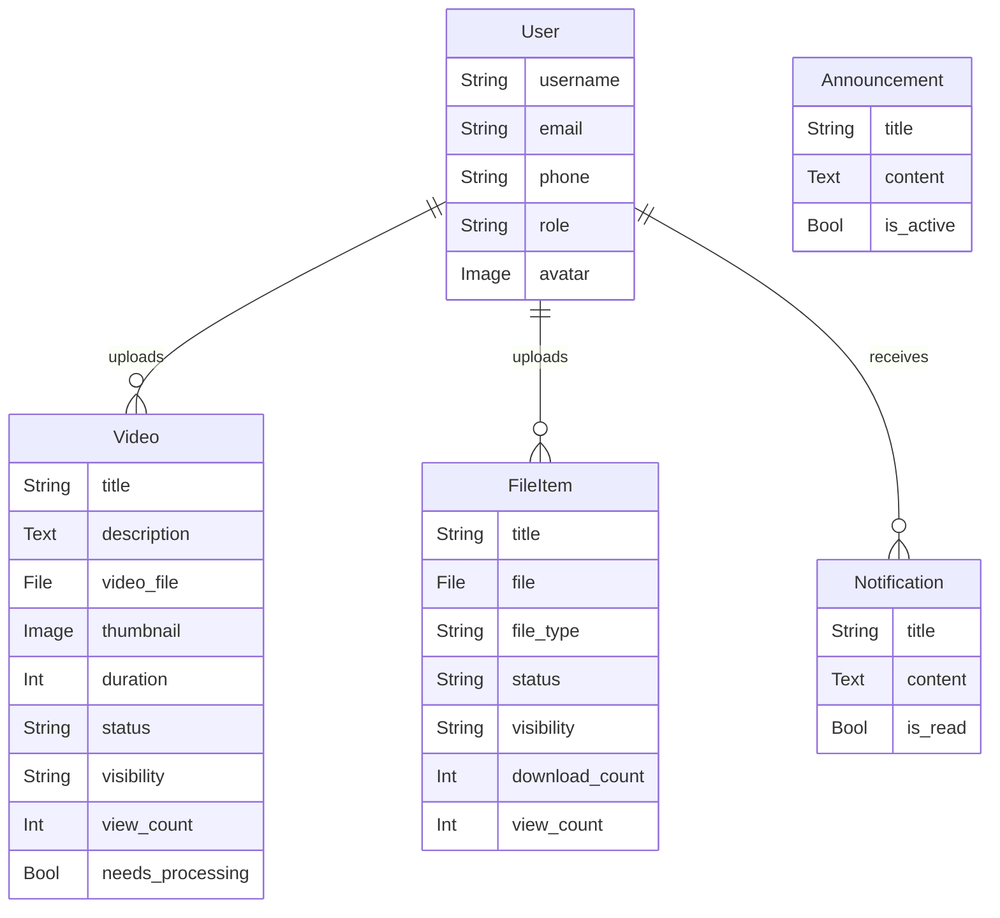
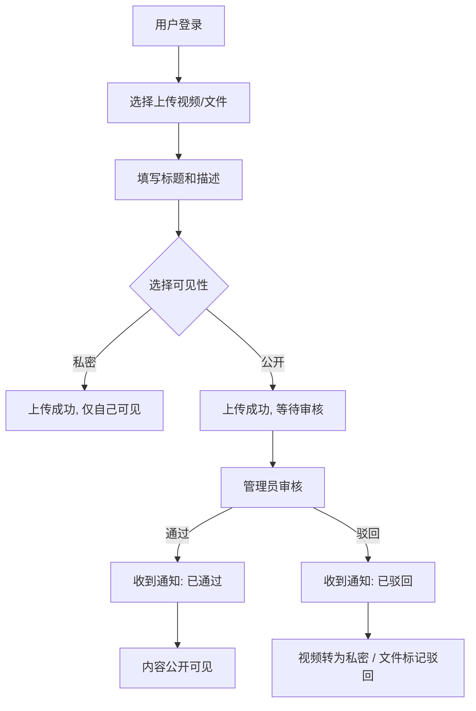
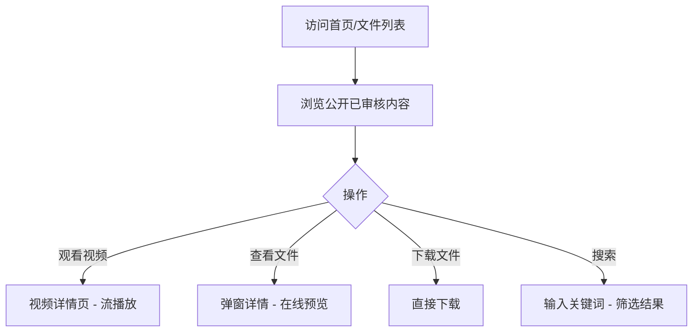
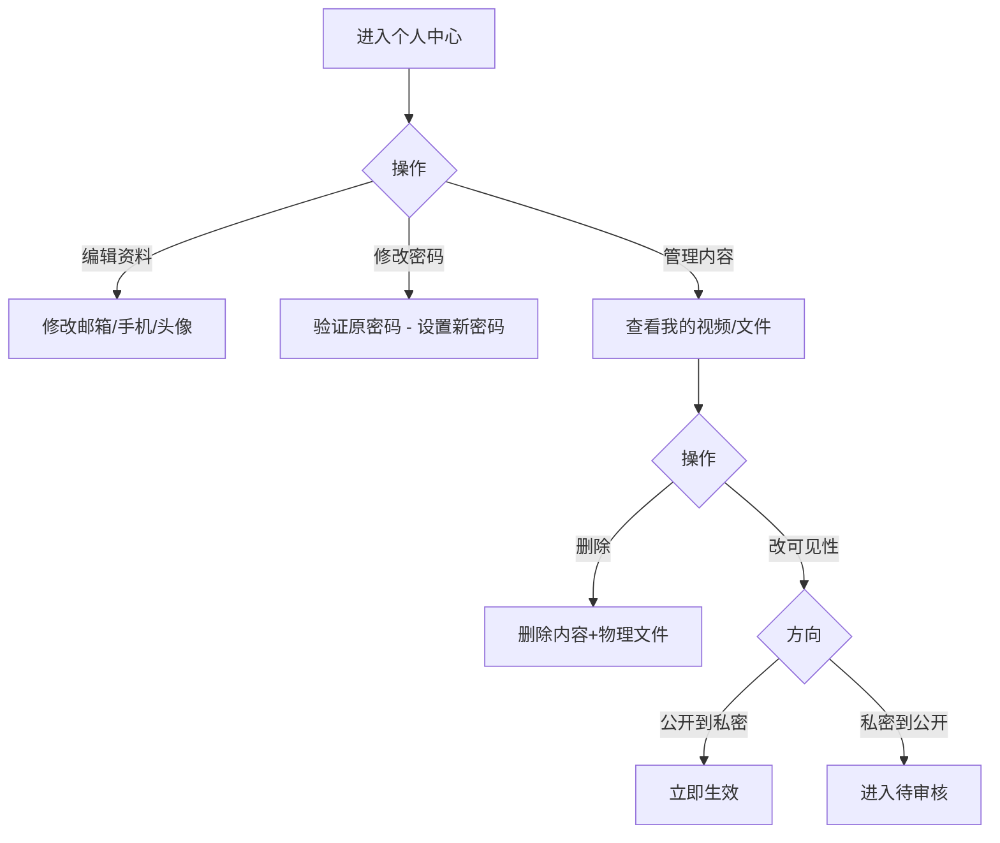

# Boke 用户端使用文档

## 概述

Boke 是一个视频和文件分享平台，用户可以上传、浏览、下载视频和文件。本文档面向普通用户，介绍所有可用功能。

---

## 功能模块

### 1. 注册与登录

#### 注册
- **入口**：`/register/`
- **必填字段**：用户名、密码、确认密码
- **可选字段**：邮箱、手机号
- **规则**：
  - 用户名不可重复
  - 邮箱不可重复
  - 密码至少6位
  - 两次密码必须一致
  - 60秒内只能注册一次（防刷限流）

#### 登录
- **入口**：`/login/`
- **方式**：用户名 + 密码
- **Session 有效期**：24小时
- **安全**：登录尝试（成功/失败）均会记录日志和IP

#### 登出
- **入口**：`/logout/`
- 清除 Session，跳转到登录页

---

### 2. 视频功能

#### 浏览视频
- **入口**：`/`（首页）
- **排序**：热门（按观看次数）/ 最新（按上传时间）
- **搜索**：支持按标题、描述、上传者搜索
- **分页**：每页20个视频
- **可见范围**：仅显示公开且审核通过的视频

#### 视频详情
- **入口**：`/videos/<id>/`
- **信息**：标题、描述、上传者、观看次数、上传时间
- **播放**：视频流通过 Nginx 直接发送（X-Accel-Redirect），支持断点续传，高效播放大文件
- **防刷**：基于 Session，同一会话只计一次观看

#### 上传视频
- **入口**：`/videos/upload/`（需登录）
- **字段**：视频文件（必填）、标题、描述、封面图片（可选）、可见性
- **限制**：文件大小不超过 1GB
- **可见性选择**：
  - **公开**：普通用户上传后进入待审核状态，管理员审核通过后公开
  - **私密**：仅自己可见，无需审核
- **自动处理**：上传后系统通过后台线程即时提取视频封面（缩放至640×360）和时长

#### 删除视频
- **入口**：`/videos/<id>/delete/`（需登录）
- 只能删除自己上传的视频
- 同时删除视频文件和封面图片

#### 批量删除
- **入口**：`/videos/batch-delete/`（需登录）
- 只能删除自己的视频

---

### 3. 文件功能

#### 浏览文件
- **入口**：`/files/`
- **分类筛选**：图片、文档、压缩包、音乐、其他
- **搜索**：支持按标题、描述搜索
- **分页**：每页20个文件
- **可见范围**：仅显示公开且审核通过的文件

#### 文件详情
- **展示方式**：在文件列表页点击卡片，通过弹窗展示文件详情（AJAX 加载 JSON 数据）
- **信息**：标题、上传者、上传时间、下载次数、文件大小、描述
- **预览**：图片直接展示、文本类文件在线预览前5000字符、音频在线播放
- **防刷**：基于 Session，同一会话只计一次查看

#### 下载文件
- **入口**：`/files/<id>/download/`
- 公开文件无需登录即可下载
- 私密文件仅上传者和管理员可下载

#### 上传文件
- **入口**：`/files/upload/`（需登录）
- **字段**：文件（必填）、标题、描述、可见性
- **自动识别类型**：根据扩展名自动分类
  - 图片：jpg/jpeg/png/gif/bmp/webp
  - 文档：txt/md/doc/docx/pdf
  - 压缩包：zip/rar/7z/tar/gz
  - 音乐：mp3/wav/flac/aac/ogg
  - 其他：以上未匹配的扩展名
- **审核规则**：同视频（公开需审核，私密自动通过）

#### 删除/批量删除
- 只能删除自己上传的文件

---

### 4. 可见性管理

用户可以在个人中心修改自己内容的可见性：

| 操作 | 效果 |
|------|------|
| 公开 → 私密 | 立即生效，状态自动变为 approved，仅自己可见 |
| 私密 → 公开 | 进入待审核状态（pending），管理员审核通过后公开 |

- 修改视频可见性：`POST /api/video/<id>/change-visibility/`，参数 `visibility=public/private`
- 修改文件可见性：`POST /api/file/<id>/change-visibility/`，参数 `visibility=public/private`

---

### 5. 个人中心

- **入口**：`/profile/`（需登录）
- **查看**：个人信息、我的视频列表（含所有状态）、我的文件列表（含所有状态）
- **编辑**：邮箱、手机号、头像（支持图片上传）
- **修改密码**：入口在个人中心侧边栏，路径 `/change-password/`，需验证原密码

---

### 6. 通知系统

- **入口**：`/notifications/`（需登录）
- **展示**：最近50条通知 + 未读计数
- **通知来源**：
  - 视频/文件审核通过
  - 视频/文件审核驳回
  - 内容转为公开状态
  - 管理员手动发送的通知
- **操作**：标记单条已读、全部已读
- **未读计数 API**：`GET /notifications/count/` 返回 `{"count": N}`，供导航栏轮询

---

### 7. 弹窗公告

- **API**：`GET /api/announcement/`（无需登录）
- 返回最新一条活跃公告的标题、内容、更新时间
- 无活跃公告时返回 `{"id": null}`
- 由管理员在后台发布和管理

---

## 用户端 ER 图

---

## 用户端核心流程图

### 上传内容流程

### 浏览与下载流程

### 个人中心流程

