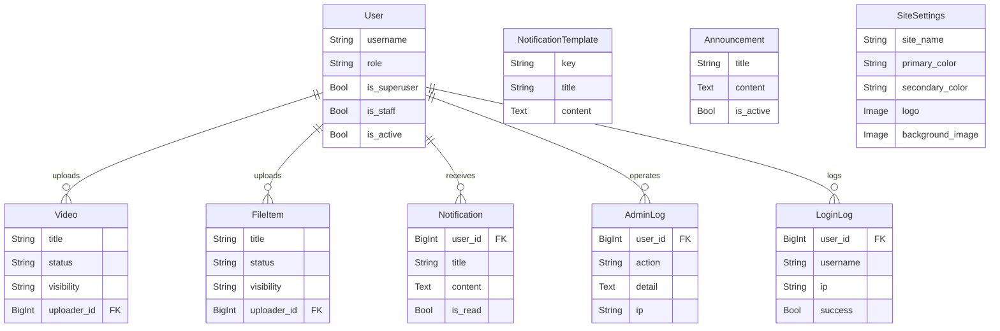
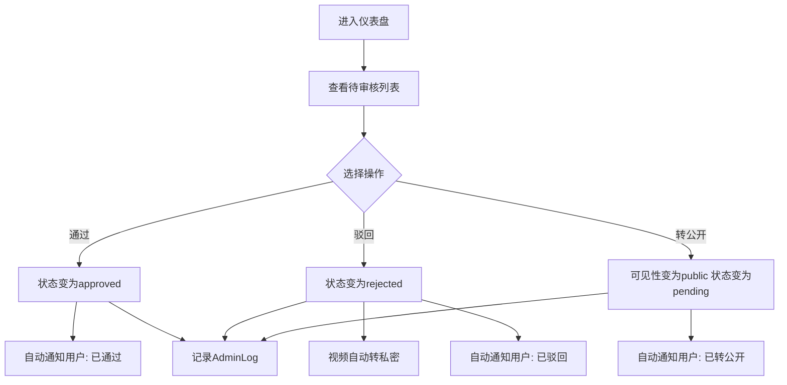
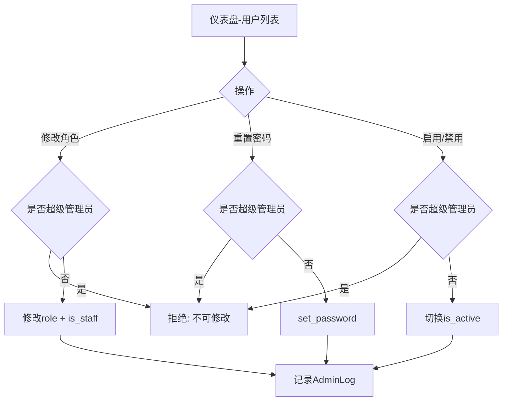
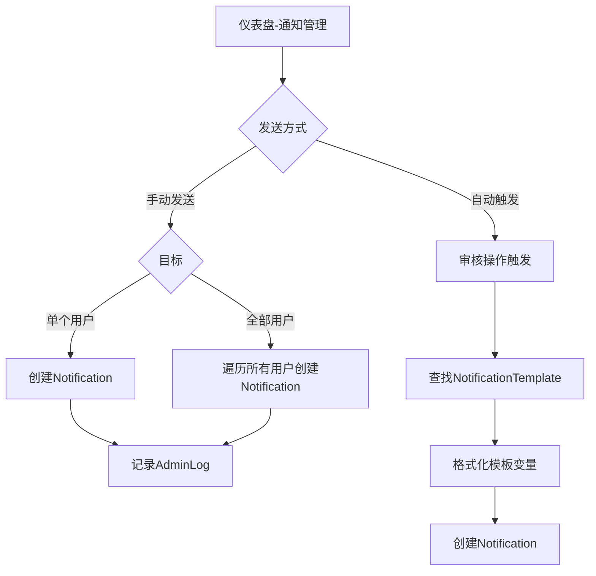
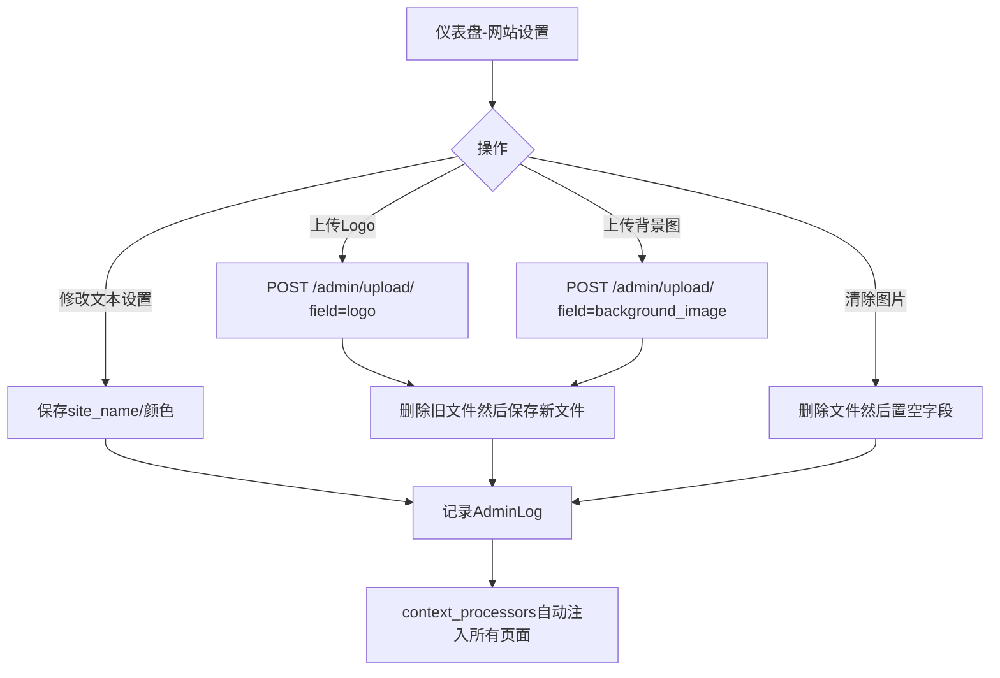

# Boke 管理员端使用文档

## 概述

管理员通过仪表盘（`/admin/`）统一管理整个平台的内容审核、用户管理、通知系统、公告发布和网站设置。管理员需要 `role='admin'` 或 `is_superuser=True` 或 `is_staff=True`。

---

## 功能模块

### 1. 仪表盘首页

- **入口**：`/admin/`（需管理员权限）
- **统计概览**：待审核内容数、已通过内容数、总内容数、注册用户数（使用聚合查询优化，减少数据库访问）
- **数据列表**：
  - 待审核视频/文件列表
  - 全部视频/文件列表（最近50条）
  - 用户列表（最近50条）
  - 通知模板列表
  - 最近通知记录（最近20条）
  - 公告列表
  - 管理员操作日志（最近50条）
  - 登录日志（最近50条）
  - 网站设置

---

### 2. 内容审核

所有操作通过 `POST /admin/action/`（JSON body）执行。操作对象不存在时返回 404，其他异常返回 500。

#### 审核操作

| 操作 | type | 参数 | 效果 |
|------|------|------|------|
| 通过审核 | `review` | model, id, action=approve | 状态→approved，自动通知用户 |
| 驳回 | `review` | model, id, action=reject | 状态→rejected，视频自动转私密，自动通知用户 |
| 转公开 | `review` | model, id, action=make_public | 可见性→public，状态→pending，自动通知用户 |

#### 状态变更

| 操作 | type | 参数 |
|------|------|------|
| 修改状态 | `change_status` | model(video/file), id, status(pending/approved/rejected) |

#### 删除内容

| 操作 | type | 参数 | 效果 |
|------|------|------|------|
| 删除 | `delete_content` | model(video/file), id | 删除数据库记录 + 物理文件（视频含封面） |

#### 审核规则
- 普通用户上传的公开内容 → 自动进入 `pending` 状态
- 管理员上传的公开内容 → 自动 `approved`
- 私密内容 → 自动 `approved`（无需审核）
- 驳回视频时自动转为私密，驳回文件时不改变可见性
- 所有审核操作自动记录 AdminLog 并通过 Notification.send_auto 发送通知

---

### 3. 通知管理

#### 发送通知

| 操作 | type | 参数 |
|------|------|------|
| 发送给单个用户 | `send_notification` | user_id, title, content |
| 群发所有用户 | `send_notification` | user_id='all', title, content |

#### 通知模板管理

| 操作 | type | 参数 |
|------|------|------|
| 编辑模板 | `save_template` | id, title, content |

**内置模板**（6个）：

| 模板标识 | 触发场景 | 可用变量 |
|----------|----------|----------|
| video_approved | 视频审核通过 | {title}, {username} |
| video_rejected | 视频审核驳回 | {title}, {username} |
| file_approved | 文件审核通过 | {title}, {username} |
| file_rejected | 文件审核驳回 | {title}, {username} |
| video_public | 视频转为公开 | {title}, {username} |
| file_public | 文件转为公开 | {title}, {username} |

模板优先从数据库读取，不存在时使用内置默认值。

---

### 4. 公告管理

| 操作 | type | 参数 |
|------|------|------|
| 创建公告 | `save_announcement` | title, content |
| 编辑公告 | `save_announcement` | id, title, content |
| 删除公告 | `delete_announcement` | id |
| 启用/停用 | `toggle_announcement` | id |

- 前端通过 `GET /api/announcement/` 获取最新活跃公告
- 同一时间展示最新的一条活跃公告（按 updated_at 降序）

---

### 5. 用户管理

| 操作 | type | 参数 | 说明 |
|------|------|------|------|
| 修改角色 | `change_user_role` | id, role(user/admin) | 同步更新 is_staff，不可修改超级管理员 |
| 重置密码 | `reset_user_password` | id, password(≥6位) | 不可修改超级管理员 |
| 启用/禁用 | `toggle_user_active` | id | 切换 is_active，不可禁用超级管理员 |

**角色权限对比**：

| 权限 | 普通用户 | 管理员 | 超级管理员 |
|------|----------|--------|------------|
| 上传内容 | ✅ | ✅ | ✅ |
| 公开内容免审核 | ❌ | ✅ | ✅ |
| 访问仪表盘 | ❌ | ✅ | ✅ |
| 审核内容 | ❌ | ✅ | ✅ |
| 删除他人内容 | ❌ | ✅ | ✅ |
| 管理用户 | ❌ | ✅ | ✅ |
| 被修改角色/密码 | ✅ | ✅ | ❌（受保护） |

---

### 6. 网站设置

#### 文本设置

| 操作 | type | 参数 |
|------|------|------|
| 保存设置 | `save_site_settings` | site_name, primary_color, secondary_color |
| 清除背景图 | `save_site_settings` | clear_background=true |
| 清除Logo | `save_site_settings` | clear_logo=true |

#### 文件上传

通过 `POST /admin/upload/`（multipart/form-data）：

| 参数 | 说明 |
|------|------|
| field='logo', file=文件 | 上传Logo，自动删除旧文件 |
| field='background_image', file=文件 | 上传背景图，自动删除旧文件 |

**可配置项**：网站名称、主题色(primary_color)、辅助色(secondary_color)、Logo图片、背景图片

设置通过 `config.context_processors.site_settings` 自动注入所有页面模板，模板中使用 `{{ site_settings.site_name }}` 等变量访问。

---

### 7. 日志系统

#### 管理员操作日志 (AdminLog)
- 自动记录所有仪表盘操作
- 字段：操作人、操作类型、详情、IP（支持 X-Forwarded-For）、时间
- 仪表盘展示最近50条

#### 登录日志 (LoginLog)
- 记录所有登录尝试（成功 + 失败）
- 字段：用户名、用户ID（失败时为null）、IP、是否成功、时间
- 仪表盘展示最近50条

---

## 管理员端 ER 图

---

## 管理员端核心流程图

### 内容审核流程

### 用户管理流程

### 通知发送流程

### 网站设置流程

