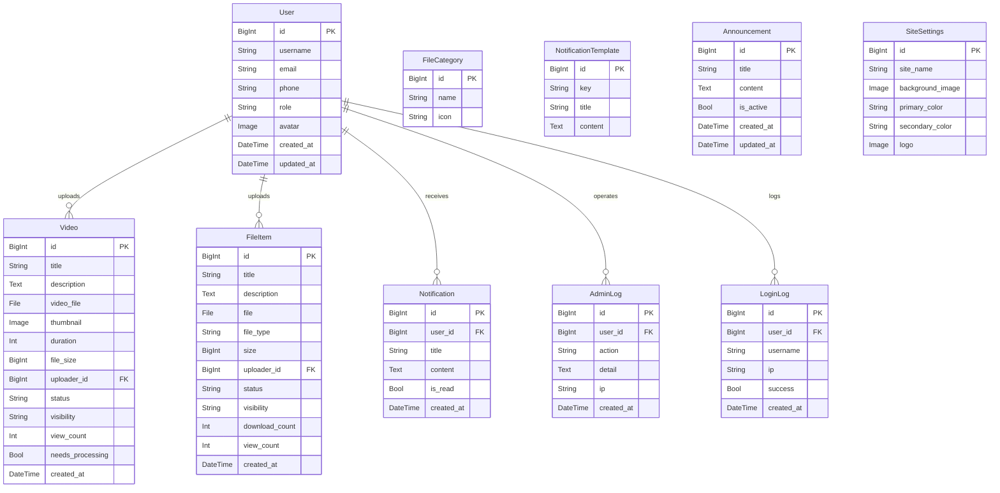
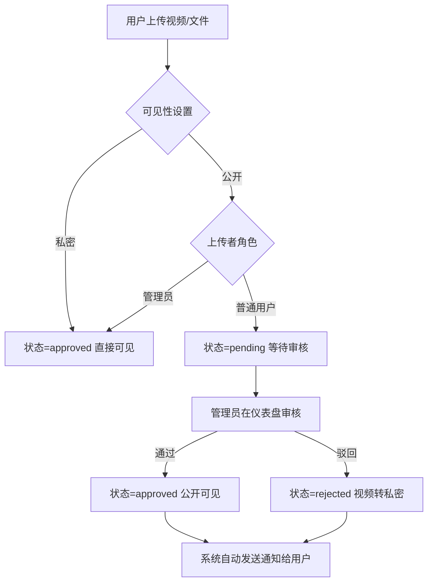
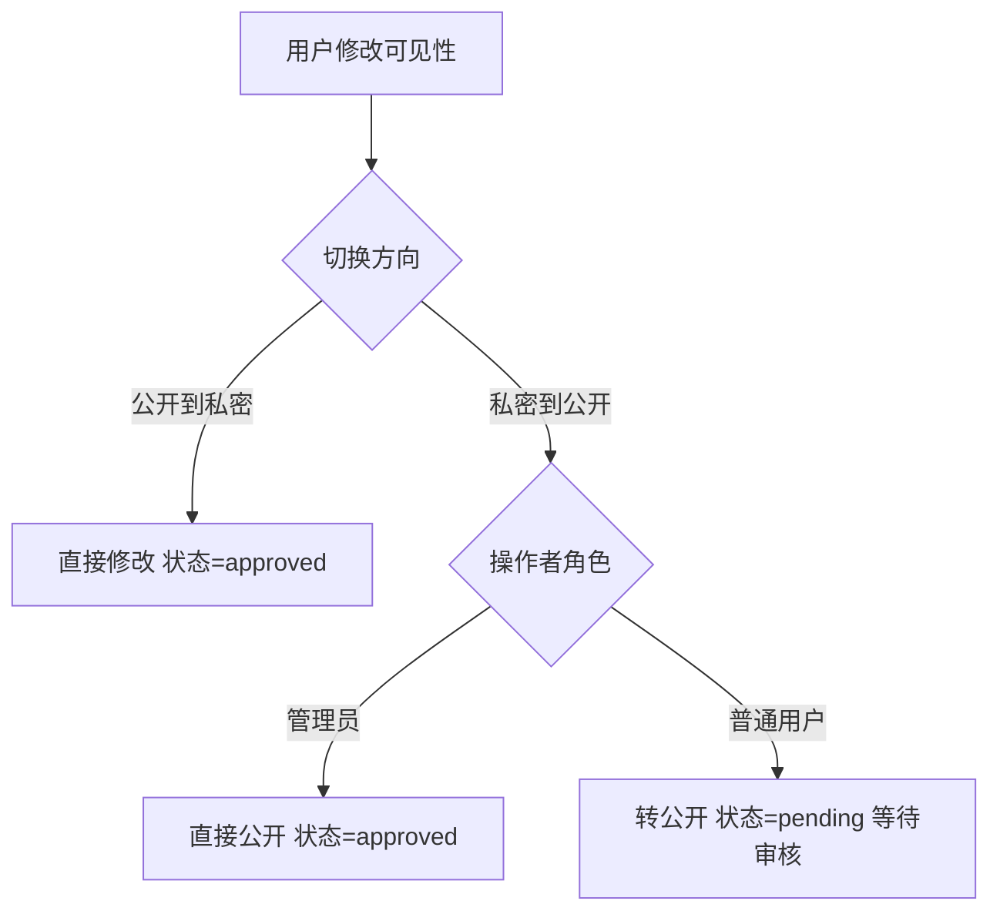
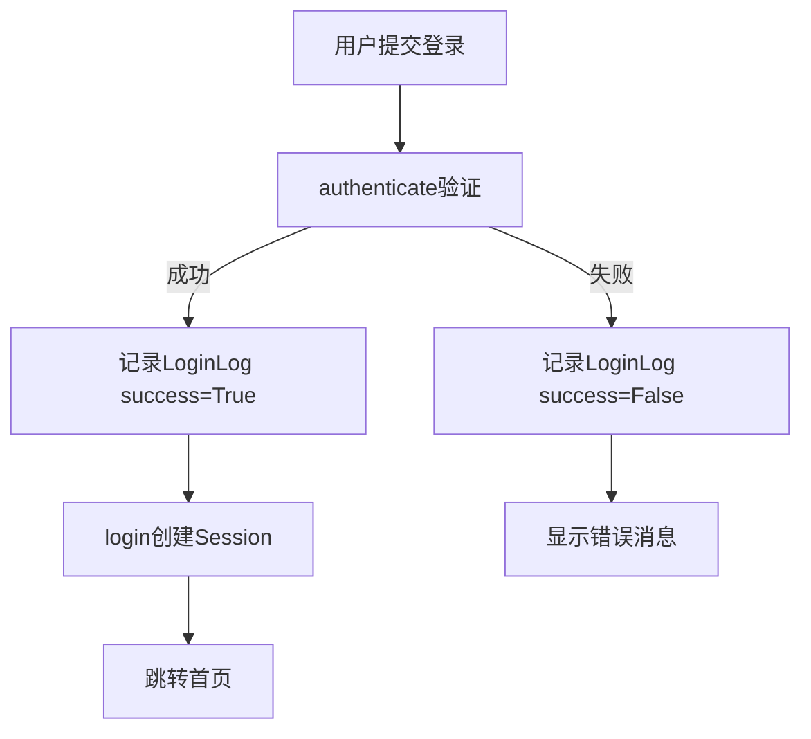

# Boke 博客/文件管理系统 - 项目文档

## 项目概述

Boke 是一个基于 Django 的内容管理系统，支持视频和文件的上传、管理、审核和分享。系统分为用户端和管理员端，采用审核制管理公开内容。

- **技术栈**：Django 5.x + MySQL + Gunicorn + Nginx + ffmpeg
- **域名**：teselx.cn
- **数据库**：MySQL (boke_db)，字符集 utf8mb4

---

## 项目结构

```
boke/
├── config/                    # 项目配置
│   ├── settings.py            # Django 核心配置
│   ├── urls.py                # URL 路由总入口
│   ├── wsgi.py                # WSGI 应用入口
│   └── context_processors.py  # 全局模板上下文处理器
├── core/                      # 核心模块
│   ├── models.py              # 通知、日志、公告模型
│   ├── message_service.py     # 统一消息服务
│   ├── review_service.py      # 统一审核服务
│   ├── dashboard_views.py     # 管理员仪表盘
│   ├── notification_views.py  # 通知系统视图
│   └── apps.py                # 应用配置
├── accounts/                  # 用户模块
│   ├── models.py              # User 模型 + SiteSettings
│   ├── views.py               # 注册/登录/个人中心/API
│   └── urls.py                # 用户路由
├── files/                     # 文件模块
│   ├── models.py              # FileCategory + FileItem 模型
│   ├── views.py               # 文件列表/详情/上传/下载/审核
│   └── urls.py                # 文件路由
├── videos/                    # 视频模块
│   ├── models.py              # Video 模型
│   ├── views.py               # 视频列表/详情/流播放/上传/审核
│   ├── urls.py                # 视频路由
│   ├── utils.py               # ffmpeg 视频处理工具
│   └── management/commands/   # 管理命令
│       └── process_videos.py  # 视频封面/时长定时处理
├── templates/                 # 模板文件
├── static/                    # 静态资源 (CSS/JS)
├── media/                     # 用户上传文件
├── gunicorn_config.py         # Gunicorn 部署配置
└── manage.py                  # Django 管理命令入口
```

---

## 各文件功能说明

### config/ - 项目配置

| 文件 | 功能 | 联动 |
|------|------|------|
| `settings.py` | Django 核心配置：数据库(MySQL)、已安装应用、中间件、模板引擎、静态/媒体文件、自定义用户模型、文件上传限制(1GB)、Session、CORS | 所有模块 |
| `urls.py` | URL 路由总入口，分发请求到管理员仪表盘、通知系统、videos、files、accounts | core、videos、files、accounts |
| `wsgi.py` | WSGI 应用入口，Gunicorn 通过此文件启动 Django | gunicorn_config.py |
| `context_processors.py` | 全局模板上下文处理器，将 SiteSettings（网站名称、主题色、Logo、背景图）注入所有模板 | accounts.models.SiteSettings、所有模板 |

### core/ - 核心模块

| 文件 | 功能 | 联动 |
|------|------|------|
| `models.py` | 定义5个核心模型：NotificationTemplate(通知模板)、Notification(用户通知)、AdminLog(管理员操作日志)、LoginLog(登录日志)、Announcement(弹窗公告) | dashboard_views、notification_views、accounts.views |
| `message_service.py` | 统一消息服务：预定义所有提示文案、Django messages 集成(页面跳转)、标准化 JSON 响应(AJAX)、便捷函数 msg_success/msg_error/json_success/json_error | accounts.views、files.views、videos.views |
| `review_service.py` | 统一审核服务：确定初始审核状态、通过/驳回审核、修改可见性(私密↔公开)、批量审核、审核统计 | files.views、videos.views、accounts.views |
| `dashboard_views.py` | 管理员仪表盘：主页(聚合统计+列表)、12种操作handler(审核、通知、模板、公告、状态变更、删除内容、用户角色、密码重置、启禁用、网站设置、文件上传)，操作对象不存在时返回404 | 所有模型、accounts.models、videos.models、files.models |
| `notification_views.py` | 通知系统视图：通知列表页、标记已读(单条/全部)、未读计数API、活跃公告API | core.models.Notification、core.models.Announcement |
| `apps.py` | Django 应用配置，注册 core 应用 | settings.py INSTALLED_APPS |

### accounts/ - 用户模块

| 文件 | 功能 | 联动 |
|------|------|------|
| `models.py` | User 模型(扩展 AbstractUser，增加 role/avatar/phone 字段，is_admin_role 属性)；SiteSettings 模型(网站名称/主题色/Logo/背景图，单例模式) | 所有模块通过 AUTH_USER_MODEL 关联 |
| `views.py` | 注册(含60秒限流)/登录(含登录日志)/登出/个人中心(含用户视频和文件列表)/修改密码(含会话保持)/获取网站设置API/更新网站设置API/修改视频可见性/修改文件可见性 | core.message_service、core.review_service、core.models.LoginLog、videos.models、files.models |
| `urls.py` | 用户路由(app_name='accounts')：注册、登录、登出、个人中心、网站设置API、可见性修改API | config.urls |

### files/ - 文件模块

| 文件 | 功能 | 联动 |
|------|------|------|
| `models.py` | FileCategory(文件分类)；FileItem(文件项：标题、描述、文件、类型、大小、上传者、审核状态(索引)、可见性(索引)、下载/查看次数) | accounts.models.User(uploader) |
| `views.py` | 文件列表(分类筛选+搜索+分页)、文件详情(JSON接口，弹窗展示，session防刷)、文件下载(Nginx X-Accel-Redirect，私密权限校验)、上传(自动识别类型)、删除/批量删除(事务保护)、审核通过/驳回 | core.review_service、core.message_service |
| `urls.py` | 文件路由(app_name='files')：列表、详情、下载、上传、删除、批量删除、审核 | config.urls |

### videos/ - 视频模块

| 文件 | 功能 | 联动 |
|------|------|------|
| `models.py` | Video 模型：标题、描述、视频文件、封面、时长、文件大小、上传者、审核状态(索引)、可见性(索引)、观看次数、待处理标记(needs_processing) | accounts.models.User(uploader) |
| `views.py` | 首页视频列表(搜索+排序+分页)、视频详情(session防刷)、视频流播放(Nginx X-Accel-Redirect)、上传(后台线程即时提取封面和时长)、删除/批量删除(事务保护)、审核通过/驳回 | core.review_service、core.message_service、videos.utils |
| `urls.py` | 视频路由(app_name='videos')：首页、详情、播放、上传、删除、批量删除、审核 | config.urls |
| `utils.py` | ffmpeg 视频处理工具：extract_thumbnail(截取封面)、get_video_duration(获取时长)、get_video_info(获取宽高/码率) | videos.views.upload_video_view |

### 根目录文件

| 文件 | 功能 |
|------|------|
| `gunicorn_config.py` | Gunicorn 生产部署配置：绑定127.0.0.1:8000、Worker数=CPU×2+1、gthread模式(每Worker 4线程)、超时30分钟(大文件上传)、日志配置 |
| `manage.py` | Django 管理命令入口 |

---

## ER 图（实体关系图）



---

## 核心业务流程图

### 内容上传与审核流程



### 可见性切换流程



### 用户登录流程



---

## URL 路由总览

| 路径 | 视图 | 说明 |
|------|------|------|
| `/` | videos.views.index | 首页（视频列表） |
| `/admin/` | core.dashboard_views.dashboard | 管理员仪表盘 |
| `/admin/action/` | core.dashboard_views.dashboard_action | 仪表盘操作API |
| `/admin/upload/` | core.dashboard_views.dashboard_upload | 仪表盘文件上传 |
| `/notifications/` | core.notification_views.notification_list | 通知列表 |
| `/notifications/read/` | core.notification_views.notification_read | 标记已读 |
| `/notifications/count/` | core.notification_views.notification_count | 未读计数API |
| `/api/announcement/` | core.notification_views.active_announcement | 活跃公告API |
| `/videos/<id>/` | videos.views.video_detail_view | 视频详情 |
| `/videos/<id>/play/` | videos.views.video_stream_view | 视频流播放 |
| `/videos/upload/` | videos.views.upload_video_view | 上传视频 |
| `/videos/<id>/delete/` | videos.views.delete_video_view | 删除视频 |
| `/videos/batch-delete/` | videos.views.batch_delete_videos_view | 批量删除视频 |
| `/videos/<id>/approve/` | videos.views.approve_video_view | 审核通过视频 |
| `/videos/<id>/reject/` | videos.views.reject_video_view | 驳回视频 |
| `/files/` | files.views.file_list_view | 文件列表 |
| `/files/<id>/` | files.views.file_detail_view | 文件详情（JSON接口，供列表页弹窗使用） |
| `/files/<id>/download/` | files.views.file_download_view | 文件下载 |
| `/files/upload/` | files.views.upload_file_view | 上传文件 |
| `/files/<id>/delete/` | files.views.delete_file_view | 删除文件 |
| `/files/batch-delete/` | files.views.batch_delete_files_view | 批量删除文件 |
| `/files/<id>/approve/` | files.views.approve_file_view | 审核通过文件 |
| `/files/<id>/reject/` | files.views.reject_file_view | 驳回文件 |
| `/register/` | accounts.views.register_view | 用户注册 |
| `/login/` | accounts.views.login_view | 用户登录 |
| `/logout/` | accounts.views.logout_view | 用户登出 |
| `/profile/` | accounts.views.profile_view | 个人中心 |
| `/change-password/` | accounts.views.change_password_view | 修改密码 |
| `/api/site-settings/` | accounts.views.get_site_settings | 获取网站设置 |
| `/api/update-site-settings/` | accounts.views.update_site_settings | 更新网站设置 |
| `/api/video/<id>/change-visibility/` | accounts.views.change_video_visibility | 修改视频可见性 |
| `/api/file/<id>/change-visibility/` | accounts.views.change_file_visibility | 修改文件可见性 |

---

## 部署架构

```
客户端 → Nginx(443/80) → Gunicorn(127.0.0.1:8000) → Django(config.wsgi)
                ↓                       ↓
         静态文件直接返回      X-Accel-Redirect
         (/static/, /media/)   视频流/文件下载由Nginx直接发送
                                (/protected-media/ internal)
```

- Nginx 负责 HTTPS 终止、静态文件服务、反向代理、视频流/文件下载直传（X-Accel-Redirect）
- Gunicorn 以 gthread 模式运行，Worker 数 = CPU×2+1，每 Worker 4 线程
- 超时设置 30 分钟，支持大文件上传
- 视频封面/时长在上传时由后台线程即时处理，定时任务 `python manage.py process_videos` 作为兜底补充
- 日志输出到 `logs/gunicorn-access.log` 和 `logs/gunicorn-error.log`
